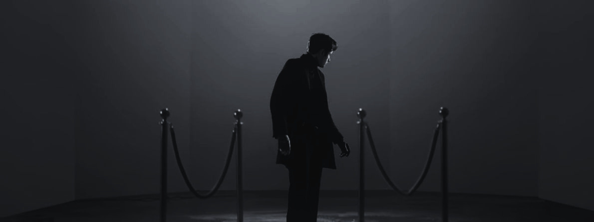
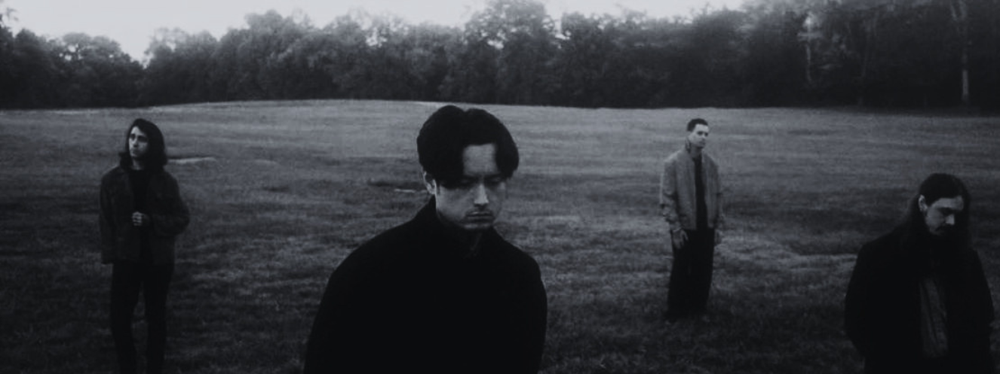

  

  

  &nbsp; D E V &nbsp; — &nbsp; S Ã O  P A U L O &nbsp; / &nbsp; S P

 

<h3 align="center">𝐒 𝐎 𝐁 𝐑 𝐄 &nbsp; 𝐌 𝐈 𝐌</h3>
<table align="center">
<tr>

<td width="60%">

Sou estudante de programação, focado no desenvolvimento Back-End e Front-End, buscando evoluir constantemente minhas habilidades na área da tecnologia. Atualmente estudo diferentes linguagens e ferramentas, utilizando o VSCode como uma das minhas principais ferramentas de programação no dia a dia.

</td>

<td width="40%" align="center">

</td>

</tr>
</table>

<h3 align="center">𝐌 𝐄 𝐔 𝐒 &nbsp; 𝐒 𝐓 𝐀 𝐓 𝐔 𝐒&nbsp;</h3>

 

<table align="center" style="border: none;">
<tr style="border: none;">

<td width="60%" style="border: none;">

  
    
  

 

---

</td>
</tr>
</table>

*"Lying in between the memories choking me and"*

  

  

<td width="40%" align="center" style="border: none;">
  

</td>

`DEV BASAGLIA · SÃO PAULO`

